# NXP Application Code Hub
[](https://www.nxp.com)

## ML State Monitor
[](https://www.nxp.com/appswpack)

This Machine Learning (ML) application software pack, [ML-Based System State  Monitor](https://www.nxp.com/design/software/embedded-software/application-software-pack-ml-state-monitor:APP-SW-PACK-ML-STATE-MONITOR), relies on Deep Learning and enables developers to develop and deploy neural networks on MCU-based systems for building smart sensing applications that use time series real-time sensed data for system state monitoring.

The example software package provides general enablement and was designed to show how to create a **Fan Vibration State Monitoring Solution** and also through an Application Note it provides details on how to validate and evaluate the performance of a model by running it through different inference engines on different evaluation kits.

To access this application software pack, click on the GitHub button to visit the NXP MCUXpresso SDK GitHub Repository and follow the steps found in the Lab Guide to evaluate the software solution.

Please visit section [Support](#step5) of this document for the extended list of associated resources.

#### Boards: FRDM-MCXN947, MIMXRT1170-EVK, LPC55S69-EVK, FRDM-K66F
#### Accessories: nxp_frdm_stbi_a8974, mikroe_accel_4_click
#### Categories: AI/ML, Anomaly detection, RTOS, SDMMC, Sensor, Tools
#### Peripherals: I2C, SDIO, SENSOR, UART, TIMER
#### Toolchains: MCUXpresso IDE

## General Enablement Diagram
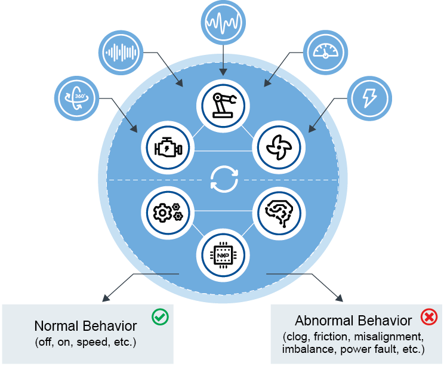

## Flow Diagram
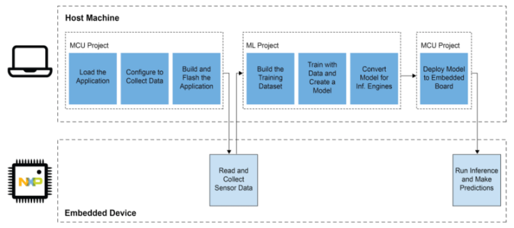

## Use Case: Fan State Classification
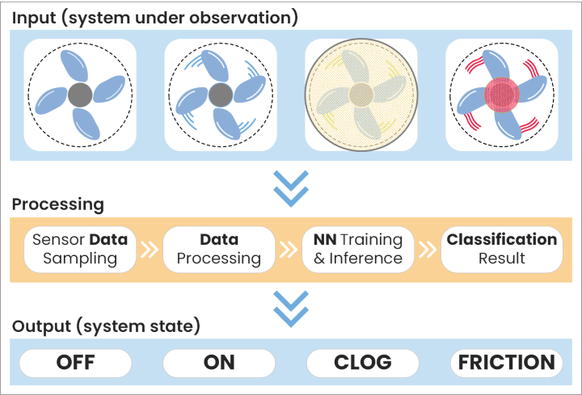

## Table of Contents
1. [Software](#step1)
2. [Hardware](#step2)
3. [Setup](#step3)
4. [Results](#step4)
5. [Support](#step5)
6. [Release Notes](#step6)

## 1. Software<a name="step1"></a>
- ML Applications provided by this package - host machine applications used to define the neural network architectures, train, and generate ML models
- MCU Applications provided by this package - software applications for targeted embedded devices (i.e., FRDM-MCXN947, MIMXRT1170-EVK, LPC55S69-EVK, FRDM-K66F) used to deploy, run, and evaluate the ML models
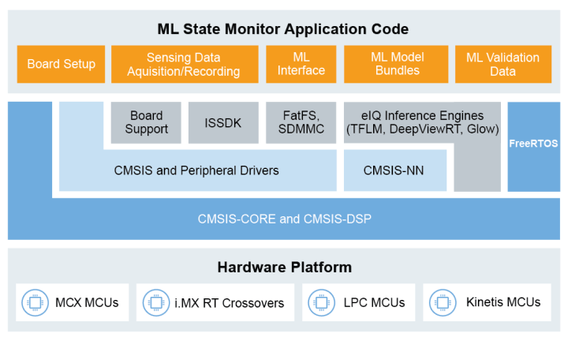

**Toolchain:**
- MCUXpresso SDK (revision [MCUX_2.14.0](https://github.com/nxp-mcuxpresso/mcux-sdk/tree/MCUX_2.14.0_MCXNx4x))
- MCUXpresso IDE
- eIQ Toolkit
- Jupyter Notebook (Python, TensorFlow, Keras, etc.)

## 2. Hardware<a name="step2"></a>
**Required:**
- Personal Computer
- Mini/micro USB cable
- Any of the following development boards:

| [FRDM-MCXN947](https://www.nxp.com/design/design-center/development-boards-and-designs/general-purpose-mcus/frdm-development-board-for-mcx-n94-n54-mcus:FRDM-MCXN947)|  [MIMXRT1170-EVK](https://www.nxp.com/design/design-center/development-boards-and-designs/i-mx-evaluation-and-development-boards/i-mx-rt1170-evaluation-kit:MIMXRT1170-EVK)|  [LPC55S69-EVK](https://www.nxp.com/design/design-center/software/development-software/mcuxpresso-software-and-tools-/lpcxpresso-boards/lpcxpresso55s69-development-board:LPC55S69-EVK)|  [FRDM-K66F](https://www.nxp.com/design/design-center/development-boards-and-designs/general-purpose-mcus/freedom-development-platform-for-kinetis-k66-k65-and-k26-mcus:FRDM-K66F)|
|:---:|:---:|:---:|:---:|
|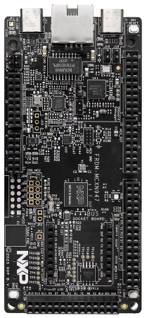| 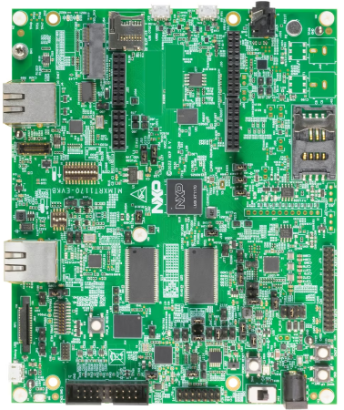| 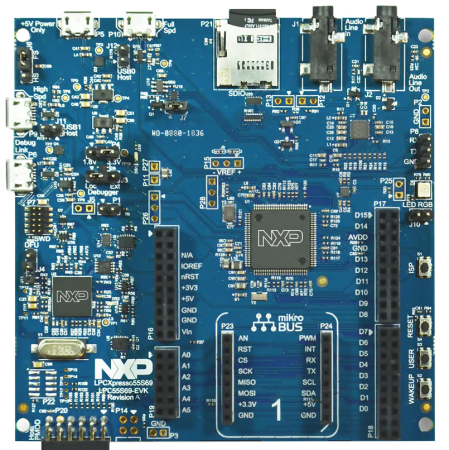| 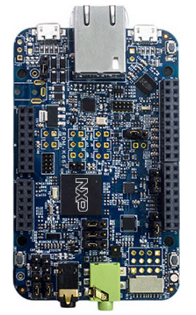|

**Optional** (*functional scenario: run inference using with real-time data read from the sensor*):
- Any of the following sensor shield boards:

| [FRDM-STBI-A8974](https://mcuxpresso.nxp.com/eb-hub/product/frdm-stbi-a8974)| [ACCEL-4-CLICK](https://mcuxpresso.nxp.com/eb-hub/product/accel-4-click)|  [FRDM-STBC-AGM01](https://www.nxp.com/products/sensors/accelerometers/digital-motion-sensor-3d-accelerometer-2g-4g-8g-plus-3d-magnetometer:FXOS8700CQ)| 
|:---:|:---:|:---:|
|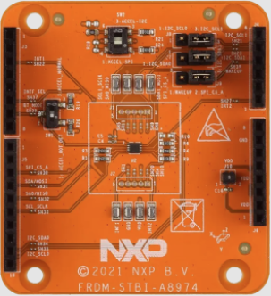| 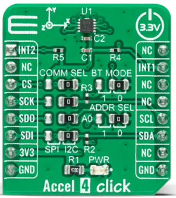| 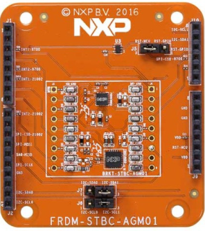|

- Arduino ProtoShield + 5V DC Fan

| [ProtoShield](https://store.arduino.cc/products/proto-shield-rev3-uno-size)| Fan | 
|:---:|:---:|
|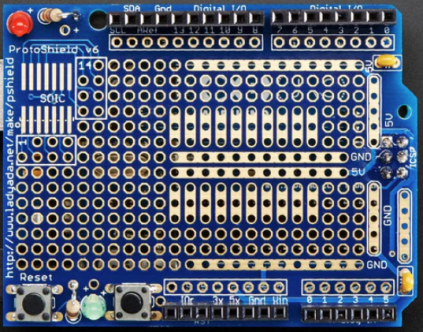| 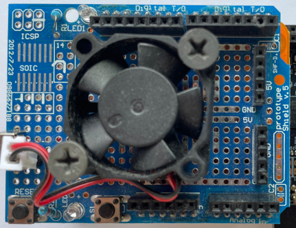| 

**Optional** (*functional scenario: read and log sensor data to be used for neural network training*):
- SD card

## 3. Setup<a name="step3"></a>

### 3.1 Assemble the application
You need to have both Git and West installed, then execute below commands to gather the whole APP-SW-PACKS/ML-State-Monitor delivery at revision ```${revision}``` and place it in a folder named ```appswpacks_ml_state_monitor```. 
```
west init -m https://github.com/nxp-appcodehub/ap-ml-state-monitor.git --mr ${revision} appswpacks_ml_state_monitor
cd appswpacks_ml_state_monitor
west update
```
Replace ```${revision}``` with any SDK revision you wish to achieve. This can be ```main``` if you want the latest state, or any commit SHA.

### 3.2 Build and run the application
To build and run the application please refer to the [Lab Guide](https://community.nxp.com/t5/eIQ-Machine-Learning-Software/Application-Software-Pack-ML-State-Monitor/ta-p/1413290?attachment-id=153366) or check the steps in [Run a project using MCUXpresso IDE](https://github.com/NXPmicro/mcux-sdk/blob/main/docs/run_a_project_using_mcux.md).

### 3.3 Hardware settings
To configure the hardware settings please refer to the [Lab Guide](https://community.nxp.com/t5/eIQ-Machine-Learning-Software/Application-Software-Pack-ML-State-Monitor/ta-p/1413290?attachment-id=153366) or follow the readme guidelines for the specific board and application that are located in the following path   `ml_state_monitor/mcu_app/boards/<board_name>/<application_name>/readme*`.

## 4. Results<a name="step4"></a>
This Application Software Pack provides support to develop and deploy neural networks on MCU-based systems for time-series data. It illustrates how to build and deploy on embedded devices neural network models capable to monitor the input sensor data and detect the state of a device.

Please refer to [AN13562](https://www.nxp.com/docs/en/application-note/AN13562.pdf) document which demonstrates through a real use case the steps required to produce and assemble a dataset, define the architecture of a neural network, train, and deploy a model on an embedded board by leveraging the NXP’s SDK and the eIQ technology.
This document also shows which metrics to use and how to evaluate the behavior of a neural network model at runtime on an embedded board, as well as benchmarks and performance results.

## 5. Support<a name="step5"></a>
Please refer to the following resources list for extended support:
- ML-Based System State Monitor [Website](https://www.nxp.com/design/software/embedded-software/application-software-packs/application-software-pack-ml-based-system-state-monitor:APP-SW-PACK-ML-STATE-MONITOR)
- ML-Based System State Monitor [Lab Guides](https://community.nxp.com/t5/eIQ-Machine-Learning-Software/Application-Software-Pack-ML-State-Monitor/ta-p/1413290)
- [Application Note AN13562](https://www.nxp.com/docs/en/application-note/AN13562.pdf) - Building and Benchmarking Deep Learning Models for Smart Sensing Appliances on MCUs
- [Application Software Packs](https://www.nxp.com/appswpack) - Full portfolio of rapid-development easy-to-use software bundles
- [MCUXpresso SDK](https://github.com/NXPmicro/mcux-sdk/) - Full SDK delivery that provides access to other SDK examples and components
- [eIQ ML Software Development Environment](https://www.nxp.com/eIQ) - ML workflow tools like eIQ Toolkit, along with inference engines, neural network compilers and optimized libraries

#### Project Metadata
<!----- Boards ----->
[](https://github.com/search?q=org%3ANXP-mcuxpresso+FRDM-MCX947+in%3Areadme&type=Repositories) [](https://github.com/search?q=org%3ANXP-mcuxpresso+MIMXRT1170-EVK+in%3Areadme&type=Repositories) [](https://github.com/search?q=org%3ANXP-mcuxpresso+LPCXpresso55S69+in%3Areadme&type=Repositories) [](https://github.com/search?q=org%3ANXP-mcuxpresso+FRDM-K66F+in%3Areadme&type=Repositories)

<!----- Categories ----->
[](https://github.com/search?q=org%3ANXP-mcuxpresso+aiml+in%3Areadme&type=Repositories) [](https://github.com/search?q=org%3ANXP-mcuxpresso+anomaly_detection+in%3Areadme&type=Repositories) [](https://github.com/search?q=org%3ANXP-mcuxpresso+rtos+in%3Areadme&type=Repositories) [](https://github.com/search?q=org%3ANXP-mcuxpresso+sdmmc+in%3Areadme&type=Repositories) [](https://github.com/search?q=org%3ANXP-mcuxpresso+sensor+in%3Areadme&type=Repositories) [](https://github.com/search?q=org%3ANXP-mcuxpresso+tools+in%3Areadme&type=Repositories)

<!----- Peripherals ----->
[](https://github.com/search?q=org%3ANXP-mcuxpresso+i2c+in%3Areadme&type=Repositories) [](https://github.com/search?q=org%3ANXP-mcuxpresso+sdio+in%3Areadme&type=Repositories) [](https://github.com/search?q=org%3ANXP-mcuxpresso+sensor+in%3Areadme&type=Repositories) [](https://github.com/search?q=org%3ANXP-mcuxpresso+uart+in%3Areadme&type=Repositories) [](https://github.com/search?q=org%3ANXP-mcuxpresso+timer+in%3Areadme&type=Repositories)

<!----- Toolchains ----->
[](https://github.com/search?q=org%3ANXP-mcuxpresso+mcux+in%3Areadme&type=Repositories)

Questions regarding the content/correctness of this example can be entered as Issues within this GitHub repository.

>**Warning**: For more general technical questions regarding NXP Microcontrollers and the difference in expected funcionality, enter your questions on the [NXP Community Forum](https://community.nxp.com/)

[](https://www.youtube.com/@NXP_Semiconductors)
[](https://www.linkedin.com/company/nxp-semiconductors)
[](https://www.facebook.com/nxpsemi/)
[](https://twitter.com/NXP)

## 6. Release Notes<a name="step6"></a>
| Version | Description / Update                           | Date                        |
|:-------:|------------------------------------------------|----------------------------:|
| 1.4.0   | Upgrade the SDK core to GitHub SDK MCUX_2.14.0 <br/> Add support for FRDM-MCXN947 and FXLS8974 accelerometer (FRDM-STBI-A8974 and ACCEL-4-CLICK sensor boards) | 2024 July |
| 1.3.0   | Add the MPP Preview Library for MCU with time series support for FXLS8974CF accelerometer <br/> Upgrade to Application Code Hub (ACH) style | 2023 July |
| 1.2.0   | Upgrade the SDK core to GitHub SDK MCUX_2.12.0 | 2022 Nov. |
| 1.1.0   | Add support for FRDM-K66F (ARM Cortex-M4) and LPCXpresso55S69 (ARM Cortex-M33) | 2022 Apr. |
| 1.0.0   | Initial release of Application Software Pack   | 2022 Feb. |
