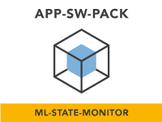

<p align="center">
	
</p>

<h1 align="center"> Application Software Pack: ML State Monitor </h1>

This repository holds the [ML-Based System State  Monitor App SW Pack](https://www.nxp.com/design/software/embedded-software/application-software-pack-ml-state-monitor:APP-SW-PACK-ML-STATE-MONITOR) and depends on the [MCUXpresso SDK](https://github.com/NXPmicro/mcux-sdk) overall delivery (revision [MCUX_2.12.0](https://github.com/NXPmicro/mcux-sdk/tree/MCUX_2.12.0)).

### Assemble the application

You need to have both Git and West installed, then execute below commands to gather the whole APP-SW-PACKS/ML-State-Monitor delivery at revision ```${revision}``` and place it in a folder named ```appswpacks_ml_state_monitor```. 
```
west init -m https://github.com/NXPmicro/appswpacks-ml-state-monitor --mr ${revision} appswpacks_ml_state_monitor
cd appswpacks_ml_state_monitor
west update
```
Replace ```${revision}``` with any SDK revision you wish to achieve. This can be ```mcux_release_github``` if you want the latest state, or any commit SHA.

### Build and run the application

To build and run the application please refer to the [Lab Guide](https://community.nxp.com/t5/eIQ-Machine-Learning-Software/Application-Software-Pack-ML-State-Monitor/ta-p/1413290) or check the steps in [Run a project using MCUXpresso IDE](https://github.com/NXPmicro/mcux-sdk/blob/main/docs/run_a_project_using_mcux.md).

### Other reference applications

For other rapid-development software bundles please visit the [Application Software Packs](https://www.nxp.com/appswpack) page.

For SDK examples please go to the [MCUXpresso SDK](https://github.com/NXPmicro/mcux-sdk/) and get the full delivery to be able to build and run examples that are based on other SDK components.
