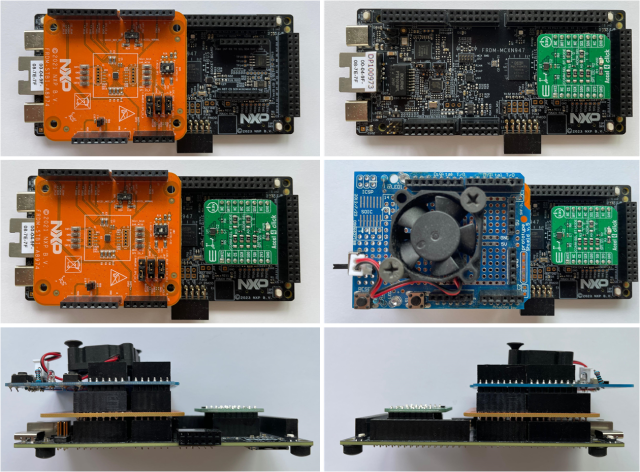

Overview
========
This project is a demonstration application that evaluates a neural network model for fan state
classification by measuring vibration data.
The model was converted in the specific format to be evaluated through TFLite Micro runtime inference engine.

The application starts by creating a main task called "MainTask" which runs the program
by following the settings configured in app_config.h.

Toolchain supported
===================
- MCUXpresso IDE 11.9.0

Hardware requirements
=====================
- Mini/micro C USB cable
- [FRDM-MCXN947](https://www.nxp.com/design/design-center/development-boards-and-designs/general-purpose-mcus/frdm-development-board-for-mcx-n94-n54-mcus:FRDM-MCXN947) board
- Personal Computer

Optional (*functional scenario: run inference for fan state classification using with real-time data read from the sensor*):
- [FRDM-STBI-A8974](https://mcuxpresso.nxp.com/eb-hub/product/frdm-stbi-a8974) board  or
[ACCEL-4-CLICK](https://mcuxpresso.nxp.com/eb-hub/product/accel-4-click) board 
- Arduino ProtoShield + 5V DC Fan

Optional (*functional scenario: read and log sensor data to be used for neural network training*):
- SD card

Board settings
==============

This example project does not call for any special hardware configurations. It can be used to evaluate a neural network model using validation static data (previously recorded real-time data) stored in memory.

This example project can also be used to evaluate the neural network in real-time by collecting live data from sensor. In this case the usage of the external parts must be enabled by configuring the following.
 
**If FRDM-STBI-A8974 sensor shield board is used:**
- SW1 Pins 2-3 should be connected to enable "ACCEL NORMAL" mode.
- SW2 Pins 2-3 should be connected to enable I2C.
- Pins 1-2 of Jumpers J7 and J8 should be connected to enable I2C0.

> *Note!*  The signal connected to SH37 & SH38 needs to be cut to isolate it to prevent
the accelerometer from being put into an incorrect mode.

- Connect the FRDM-STBI-A8974(J3, J4, J5, J6) to the Arduino connector of the FRDM-MCXN947(J1, J4, J2, J3)

- Optional: connect the Arduino ProtoShield to the Arduino connector of the FRDM-STBI-A8974(J3, J4, J5, J6)
- Connect the DC Fan to the 5V port of the Arduino ProtoShield or directly to the FRDM-STBI-A8974(J6.5-5V, J6.6-GND)

**If ACCEL-4-CLICK sensor shield board is used:**

- Connect the ACCEL-4-CLICK to the Mikro Bus Socket connector of the FRDM-MCXN947(J5, J6)
- Optional: connect the Arduino ProtoShield to the Arduino connector of the FRDM-MCXN947(J1, J4, J2, J3)
- Connect the DC Fan to the 5V port of the Arduino ProtoShield or directly to the FRDM-MCXN947(J3.10-5V, J3.12-GND)

How to change user configurations
=================================

This application supports the following configurations documented in app_config.h:

- **`SENSOR_BOARD`**: select which sensor board is being used with the FRDM-MCXN947 - *FRDM-STBI-A8974* or *ACCEL-4-CLICK*

- **`SENSOR_COLLECT_ACTION`**: select the action to be performed -
*run inference for classification* or *sensor data logging (used to collect sensor data for neural network training)*

- **`SENSOR_COLLECT_LOG_EXT_SDCARD`**: (when logging sensor data) select where to log the sensor data -
*debug console* or *SD card*

- **`SENSOR_COLLECT_RUN_INFENG`**: (when running inference) select
the inference engine to be used - *TensorFlow*

- **`SENSOR_FEED_VALIDATION_DATA`**: (when running inference) select if using
*validation (static) data from memory* or *real-time data collected from sensor*

- **`STATIC_ACCEL_VDSET`**: (when logging sensor data) select which validation dataset to use for static testing

- **`TFLITE_MODEL_TYPE`**: (when running inference) select TensorFlow model type -
*32-bit float*, *8-bit int quant*, or *neutron converted* (neutron should provide best results)

How to update Neural Network models
===================================

The Neural Network models are provided in an associated Jupyter Notebook script.
The script saves the trained models in TensorFlow Lite format and converts them to
source and object files for TensorFlow Lite for Microcontrollers inference engine.

To update the models into the project, replace the source files from source/models/tensorflow folder.
The data normalization parameters generated by the script in model_configuration.c file should be update in source/models folder.

Prepare the Demo
================
1.  Connect a USB cable between the host PC and the OpenSDA USB port on the target board.
2.  Open a serial terminal with the following settings:
    - 115200 baud rate
    - 8 data bits
    - No parity
    - One stop bit
    - No flow control
3.  Download the program to the target board.
4.  Either press the reset button on your board or launch the debugger in your IDE to begin running the demo.

> *Note!* For maximum performance use the **Release Build Configuration** profile in MCUXpresso IDE.

Running the demo
================
After the board is flashed the terminal will print *Starting Application...* and the application will start.

Example output:

```
Starting Application...
CPU: 150000000 Hz
MainTask started
MainTask exit, error status 0
SENSOR_Collect_Task started
Model loaded to SDRAM...
Inference run: t 390 us | count 181 | [2] FAN-OFF
```

Reference Pictures
==================
