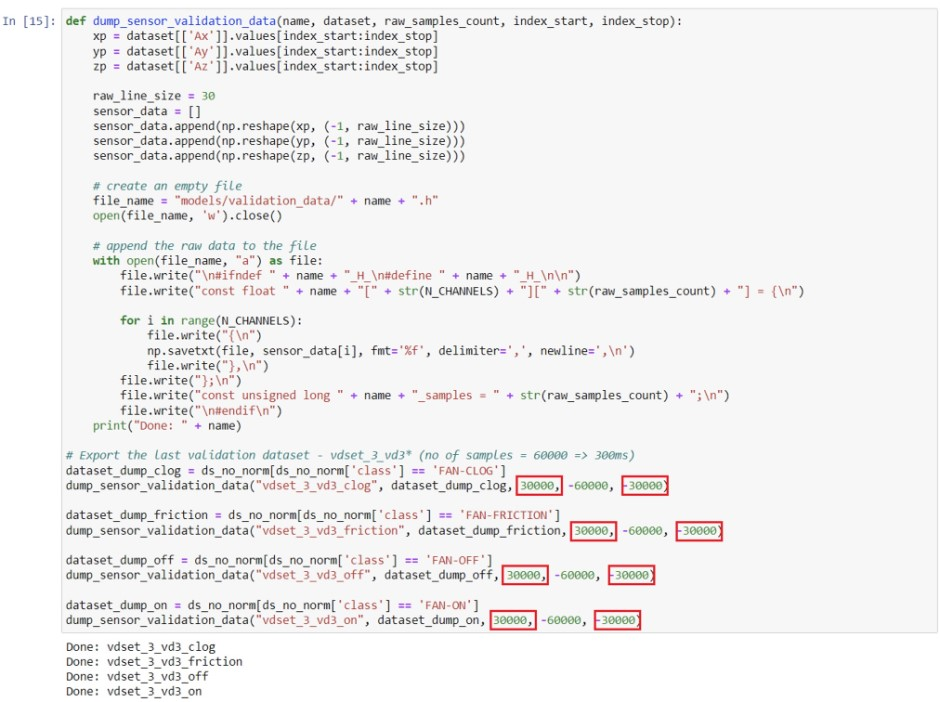
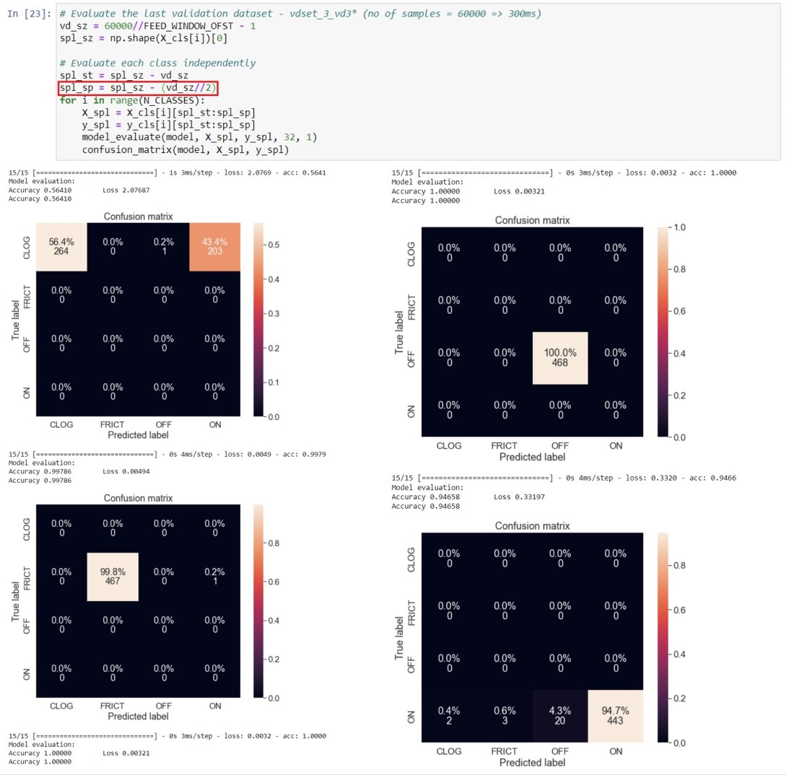
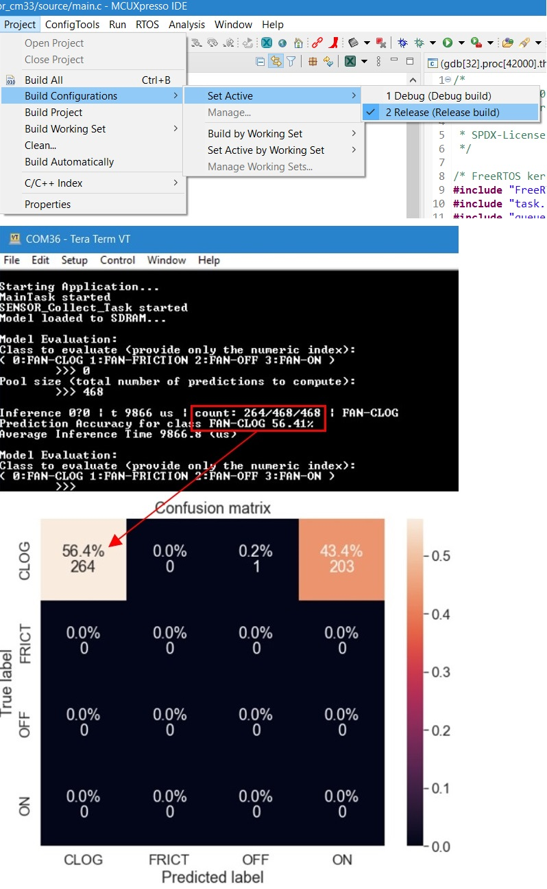

# Overview
This project is a demonstration program that evaluates a neural network model for classification.
The model was converted in the specific format to be evaluated through the following
runtime inference engines: TFLite Micro, Glow.

The application starts by creating a main task called "MainTask" which runs the program
by following the settings configured in sensor_coolect.h and model_selection.h.

# Toolchain supported
- MCUXpresso  11.5

# Hardware requirements
- Mini/micro USB cable
- lpcxpresso55s69 board
- FRDM-STBC-AGM01 board (optional)
- Arduino ProtoShield + 5V DC Fan (optional)
- SD card (optional)
- Personal Computer

# Board settings
This example project does not call for any special hardware configurations.
Though, if the external parts are used the following configuration must be followed:

On FRDM-STBC-AGM01 sensor shield board:
I2C Mode: The example uses I2C1 so the Pins 1-2 of Jumpers J6 and J7 on FRDM-STBC-AGM01 should be connected.

On lpcxpresso55s69 board:
Optional - plug the FRMD-STBC-AGM01 kit to the Arduino connector (P16, P17, P18, P19)
Optional - plug the Arduino ProtoShield + DC Fan to the Arduino connector
Optional - insert an SD card into the socket (P21)
Optional - power the DC Fan

# Prepare the Demo
1.  Connect a USB cable between the host PC and the OpenSDA USB port on the target board. 
2.  Open a serial terminal with the following settings:
    - 115200 baud rate
    - 8 data bits
    - No parity
    - One stop bit
    - No flow control
3.  Download the program to the target board.
4.  Either press the reset button on your board or launch the debugger in your IDE to begin running the demo.

# Running the demo
After the board is flashed the terminal will print "Starting Application..." and the application will start.

Example output:
```
Starting Application...
MainTask started
SENSOR_Collect_Task started
Model loaded to SDRAM...

Model Evaluation:
Class to evaluate (provide only the numeric index):
( 0:FAN-CLOG 1:FAN-FRICTION 2:FAN-OFF 3:FAN-ON )
        >>> 0
Pool size (total number of predictions to compute):
        >>> 468

Inference 0?0 | t 9866 us | count: 264/468/468 | FAN-CLOG
Prediction Accuracy for class FAN-CLOG 56.41%
Average Inference Time 9866.8 (us)
```

# Porting Guide
Since the on-chip flash is not large enough to fit all of the test data, we need to modify the jupyter notebook to generate smaller test data buffers and then re-evaluate and compare the model’s performance. 
1. Change the export size from 60,000 to 30,000 and change the end index to -30,000.\
	

2.	Copy the generated files from the last step located in ml_app/models/validation_data and paste them in mcu_app/models/validation_data.\
	

3.	In the cell that evaluates the model performance on the test data (vdset_3_vd3*), change
	```
	spl_sp = spl_sz
	```
	to
	```
	spl_sp = spl_sz – (vd_sz//2)
	```
	and re-run the cell.\
	
4.	On MCUXpresso, set the active configuration to release, build the project, load it on to the board, and run it. Compare the evaluation results from the last step with the results on the board.\
	
 
 

